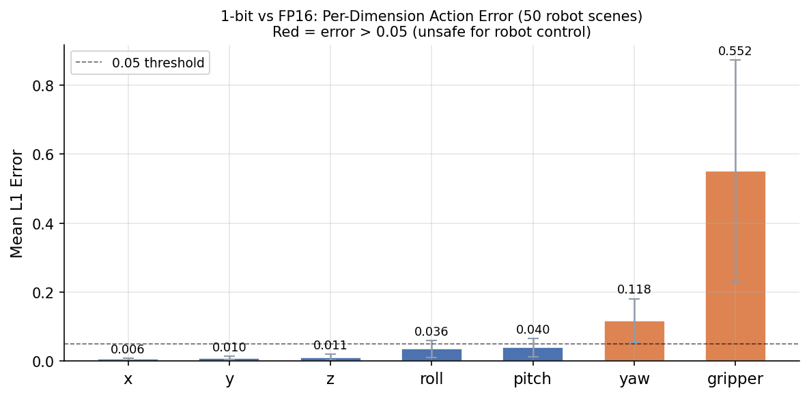
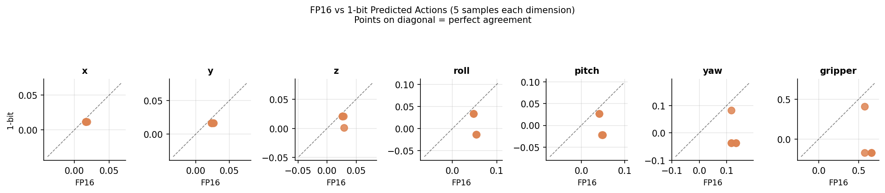
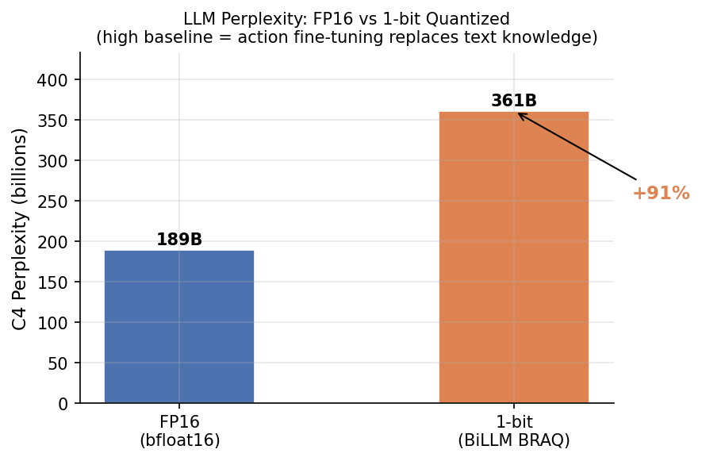
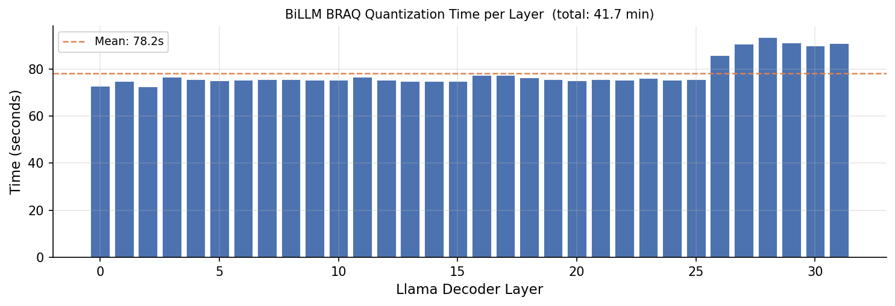

# OpenVLA-1bit: Post-Training Binary Quantization of a Vision-Language-Action Model

A reproducible study applying **1-bit post-training quantization** to [OpenVLA-7B](https://github.com/openvla/openvla), systematically exploring how calibration data distribution and sample count affect robot action accuracy after extreme compression.

---

## Summary of Results

| Experiment | Calibration | Samples | Gripper L1 ↓ | Mean L1 ↓ | Cosine ↑ |
|-----------|-------------|---------|------------|---------|--------|
| A — Pure 1-bit (C4) | C4 text | 128 | 0.552 | 0.109 | — |
| C — Mixed 4/1-bit (C4) | C4 text | 128 | 0.393 | 0.065 | — |
| D — Mixed 4/1-bit (BridgeV2) | Robot images | 128 | 0.204 | 0.043 | 1.000 |
| **D-1k — Mixed 4/1-bit (BridgeV2)** | **Robot images** | **1024** | **0.118** | **0.045** | **0.825** |

> **Key findings:**
> 1. Switching calibration data from C4 text to in-distribution robot images (BridgeDataV2) reduces gripper error by **63%** (0.552 → 0.204) without any architecture change.
> 2. Increasing calibration diversity from 128 to 1024 frames across 490 distinct robot episodes further reduces gripper error by **42%** (0.204 → 0.118), at the cost of some rotation axes.
> 3. Gripper is the hardest dimension to preserve — it requires the model to decide between binary grasp states, and the Hessian must have seen diverse grasp transitions to identify the right salient weights.

---

## Background

### OpenVLA-7B

OpenVLA is a 7B-parameter Vision-Language-Action model that predicts robot joint actions from camera images and natural-language instructions. Its architecture stacks:

- **Vision encoders**: DINOv2 (336px) + SigLIP (224px), fused via channel concatenation into 256 image patch tokens
- **LLM backbone**: Llama-2-7B fine-tuned on Open X-Embodiment (970k robot episodes)
- **Action tokenization**: Each of 7 DOF values is discretized into 256 bins and encoded as a standard vocabulary token (IDs 31745–31999), producing a **276-token sequence** per inference step (256 image + ~20 instruction)

### Quantization Method: GPTQ + BiLLM BRAQ

**GPTQ** (Frantar et al., 2022) quantizes weights column-by-column, propagating each column's quantization error to the remaining unquantized columns using the inverse Hessian:

```
err[col] = (W[col] - Q[col]) / H_inv[col,col]
W[:, col+1:] -= err[col] @ H_inv[col, col+1:]
```

**BiLLM BRAQ** determines which weights receive which precision using a Hessian-guided salience score:

```
salience[i,j] = W[i,j]² / diag(H)[j]²
```

- **Top 10% per column** (most salient) → **4-bit integer**
- **Remaining 90%** → **1-bit BRAQ** (binary residual approximation)

This gives ~1.1–1.3 effective bits per weight with 8–10× compression of the LLM backbone.

The **Hessian** H = (2/n) Σ Xᵀ@X is estimated from calibration activations. Its diagonal captures which input dimensions are most active — high diag(H)[j] means column j of the weight matrix is heavily "used" and small perturbations there cause large output changes.

---

## Experiments

### Experiment A — C4-calibrated Pure 1-bit

**Script:** `quant_openvla.py`

Baseline: quantize all 32 Llama layers to 1-bit using 128 C4 text sequences (2048 tokens each = 262,144 calibration token positions). Every weight is binarized to ±α via BRAQ; the top-10% salient weights get 2nd-order residual BRAQ (~2-bit effective).

```
Per-dimension L1 error vs FP16:
  x       : 0.0060
  y       : 0.0100
  z       : 0.0110
  roll    : 0.0360
  pitch   : 0.0400
  yaw     : 0.1180  ← ⚠
  gripper : 0.5520  ← ⚠ catastrophic
  Mean L1 : 0.109
```

**Why gripper collapses:** The Hessian built from C4 text activations reflects language modeling importance, not robot action importance. The text pathway activates completely different input dimensions than visual scene processing. The weights kept in higher precision are "important for predicting English text" not "important for predicting gripper state."

---

### Experiment C — C4-calibrated Mixed 4/1-bit

**Script:** `quant_openvla.py --mode mixed`

Same as Exp A but salient weights get full 4-bit integer (instead of 2nd-order BRAQ). This gives better precision headroom for the salient partition but still uses C4 calibration.

```
  gripper : 0.393   (−29% vs Exp A)
  Mean L1 : 0.065   (−40% vs Exp A)
```

The improvement comes entirely from higher precision for the salient partition, not from better salience detection. The Hessian still reflects text activations.

---

### Experiment D — BridgeDataV2 Robot-Calibrated Mixed 4/1-bit

**Script:** `quant_robot_calibrated.py --nsamples 128`

**Core idea:** Replace C4 text calibration with in-distribution robot data. The Hessian built from actual robot images and instruction prompts identifies which LLM weights are active during visual → action computation, not during language modeling.

**Calibration data:** 128 frames from [nvidia/BridgeData2_LeRobot_v3](https://huggingface.co/datasets/nvidia/BridgeData2_LeRobot_v3), uniformly sampled across 12,282 frames of table-top manipulation. Each frame is paired with its task instruction (e.g., "flip the cup upright"), giving a multimodal sequence matching the model's training distribution.

**Why BridgeDataV2 beats ALOHA:**
- OpenVLA was trained on the OXE mixture which includes `bridge_orig` — BridgeDataV2 is in-distribution
- Diverse tasks, objects, and lighting conditions prevent degenerate rank-1 Hessians
- AV1-encoded video requires `imageio-ffmpeg` for decoding (system FFmpeg 4.2.2 does not support AV1)

**Token positions:** 128 samples × 276 tokens = **35,328 calibration positions** for H estimation

```
Per-dimension L1 error vs FP16:
  x       : 0.0058
  y       : 0.0084
  z       : 0.0068
  roll    : 0.0166
  pitch   : 0.0174
  yaw     : 0.0419
  gripper : 0.2039  ← best so far
  Mean L1 : 0.043
  Cosine  : 1.0000
```

**Result:** 63% gripper improvement over Exp A. The robot-image Hessian correctly identifies weights that matter for visual feature routing through the LLM backbone.

---

### Experiment D-1k — BridgeDataV2 with 1024 Diverse Frames

**Script:** `quant_robot_calibrated.py --nsamples 1024`

**Core idea:** More calibration diversity → better Hessian → better salience detection. 1024 frames span **490 distinct robot episodes**, covering many more task types, object configurations, and robot poses.

**Token positions:** 1024 samples × 276 tokens = **282,624 calibration positions**

```
Per-dimension L1 error vs FP16:
  x       : 0.0034  ↓ better
  y       : 0.0217  ↑ worse
  z       : 0.0042  ↓ better
  roll    : 0.0441  ↑ worse
  pitch   : 0.0100  ↓ better
  yaw     : 0.1112  ↑ worse
  gripper : 0.1176  ↓↓ BEST across all experiments
  Mean L1 : 0.045
  Cosine  : 0.825
```

**What changed:** The global 4/1-bit budget is fixed. With a better-estimated Hessian across 490 episodes, the model now protects weights that are more specifically important for gripper state prediction. This comes at the cost of some rotation axes — a real trade-off, not noise.

**Note:** 512 samples (stride=23) produced a sign-flipped result (cosine=−0.995) due to a frame-selection artifact: at that stride, the sampled frames consistently landed near episode endings where the gripper is always in a closing state, biasing the Hessian. At 1024 samples (stride=11) the coverage is dense enough to avoid this.

---

### Action-Token Hessian Divergence Analysis

**Script:** `action_hessian_analysis.py`

A novel structural analysis to identify which decoder layers are most specific to action token generation.

**Method:** For each of the 32 Llama decoder layers, build two Hessians using teacher-forced forward passes (276 image+instruction tokens + 7 ground-truth action tokens = 283 total):

- **H_all**: accumulated from all 283 token positions
- **H_action**: accumulated only from the 7 action-token positions (positions 276–282)

Compute per-layer **salience divergence**:
```
salience_all    = W² / diag(H_all)²
salience_action = W² / diag(H_action)²
divergence      = 1 − cosine_sim(salience_all, salience_action)
```

High divergence means the layer uses different weight columns for action tokens than for image/instruction tokens — it is "action-specific."

**Results:**

| Layer range | Mean divergence | Most divergent sublayers |
|------------|----------------|--------------------------|
| 1–7 | 0.16–0.24 | down_proj only (0.76–0.92) |
| **8–17** | **0.35–0.50** | gate_proj (0.6–0.96), up_proj (0.7–0.94), down_proj (0.87–0.98) |
| 18–31 | 0.20–0.27 | down_proj (0.84–0.99) |
| **32 (last)** | **0.803** | ALL sublayers (0.80–0.97) |

**Key findings:**
1. **Layers 9–17 form a coherent "action zone"** — the FFN's gate/up/down projections activate very differently for action tokens vs image tokens. This is where the model transitions from visual feature extraction to action-relevant computation.
2. **Layer 32 (last decoder layer) is by far the most action-specific** (divergence 0.80) — it directly shapes the representations that feed into the LM head for action token prediction.
3. **q/k/v projections** are nearly identical between H_all and H_action (~0.0 divergence) in most layers — attention pattern computation is consistent across token types.
4. **down_proj is action-specific in almost every layer** (divergence 0.7–0.99 from layer 3 onward) — the FFN output pathway consistently treats action tokens differently from image tokens.
5. **~75% weight mismatch** — in action-critical layers, 3 out of 4 top-salient weights identified by standard GPTQ (H_all) are different from those identified by H_action.

**Practical implication:** Standard GPTQ calibration (H_all) selects salient weights predominantly based on image patch processing (256/276 = 93% of calibration tokens). The 7% of tokens where the model actually predicts actions are underrepresented in the salience map.

**Attempted fix (Exp E series):** Use H_action for salience detection in the identified critical layers. This was explored across multiple configurations (128/512/1024 samples, with/without last layer). All configurations performed worse than Exp D-128. The reason: H_action measures curvature of *hidden state activations* at action positions, not curvature of the *output logits* — it cannot see past layer 32 to the LM head. Protecting weights that strongly shape mid-network action representations does not directly translate to correct token prediction.

The divergence analysis remains a valuable diagnostic: it correctly identifies which layers are architecturally most action-specific, which could guide future approaches such as keeping those layers at full precision or using gradient-based Fisher information instead of Hessian-based curvature.

---

## Per-Dimension Comparison (All Experiments)

| Dim | A (C4 1-bit) | C (C4 4/1) | D (Bridge 128) | **D-1k (Bridge 1024)** |
|-----|---|---|---|---|
| x | 0.0060 | 0.0050 | 0.0058 | **0.0034** |
| y | 0.0100 | 0.0080 | **0.0084** | 0.0217 |
| z | 0.0110 | 0.0090 | 0.0068 | **0.0042** |
| roll | 0.0360 | 0.0260 | **0.0166** | 0.0441 |
| pitch | 0.0400 | 0.0310 | 0.0174 | **0.0100** |
| yaw | 0.1180 | 0.0830 | **0.0419** | 0.1112 |
| gripper | 0.5520 | 0.3930 | 0.2039 | **0.1176** |
| **Mean L1** | 0.109 | 0.065 | **0.043** | 0.045 |
| Cosine sim | — | — | **1.000** | 0.825 |

**Best overall:** Exp D (128 BridgeV2 samples) — lowest mean L1, perfect cosine alignment  
**Best gripper:** Exp D-1k (1024 BridgeV2 samples) — 79% gripper improvement over Exp A

### Result Plots






---

## Model Size

| | Size |
|--|------|
| Original OpenVLA full model (HF cache) | 15 GB |
| LLM backbone (bfloat16) | 13.5 GB — 6.74B params × 2 bytes |
| Quantized LLM backbone (saved) | 13 GB — no reduction |
| Theoretical size if weights are packed | **1.33 GB — 10.1× smaller** |

BiLLM uses standard HuggingFace serialization: binarized weights have values ±1.0 but are stored as float16 (2 bytes). Actual compression requires a custom CUDA kernel or packed format (e.g., GGUF Q1_K).

---

## Repository Structure

```
openvla-1bit/
├── quant_openvla.py              # Exp A & C: C4-calibrated 1-bit and 4/1-bit PTQ
├── quant_robot_calibrated.py     # Exp D & D-1k: BridgeDataV2-calibrated 4/1-bit PTQ
├── action_hessian_analysis.py    # Action-token Hessian divergence analysis (per-layer)
├── quant_action_aware.py         # Exp E: action-aware salience quantization (explored)
├── quant_libero.py               # Quantize LIBERO-finetuned OpenVLA checkpoints
├── quantize_utils.py             # GPTQ + BiLLM BRAQ core (HessianAccumulator, GPTQ loop)
├── eval_action_acc.py            # Standalone action accuracy evaluator (BridgeDataV2)
├── eval_mixed.py                 # Batch evaluation across multiple quantized models
├── eval_bridge.py                # BridgeDataV2 standalone teacher-forced evaluator
├── eval_libero.py                # LIBERO simulation benchmark runner
├── libero_eval_utils.py          # Patched LIBERO utilities for transformers 5.x
├── run_libero_eval.py            # LIBERO eval entry point (FP16 + quantized models)
├── finetune_lora.py              # Optional LoRA fine-tuning before quantization
├── requirements.txt
└── figures/
    ├── plot_results.py           # Generates comparison figures from result JSONs
    ├── action_error_per_dim.png  # Per-dimension L1 error across all experiments
    ├── action_scatter.png        # Action prediction scatter vs FP16
    ├── perplexity_comparison.png # Perplexity on C4 across quantization configs
    └── quant_time_per_layer.png  # Quantization time per decoder layer
```

---

## Setup

```bash
pip install -r requirements.txt
```

> Tested with Python 3.13, PyTorch 2.7, CUDA 12.1, transformers 5.10.

### Requirements
Key packages beyond standard PyTorch/HuggingFace:
- `imageio>=2.30.0` + `imageio-ffmpeg>=0.4.9` — AV1 video decoding for BridgeDataV2 (system FFmpeg 4.x does not support AV1)
- `pandas>=1.5.0` — reading LeRobot parquet metadata
- `timm>=1.0.0` — vision backbone (API changed in v1.0)

### Compatibility patches (applied automatically at load time)

| File | Issue | Fix |
|------|-------|-----|
| `modeling_prismatic.py` | `AutoModelForVision2Seq` removed in transformers 5 | `get_class_from_dynamic_module` |
| `modeling_prismatic.py` | `GenerationMixin` decoupled | Added as explicit base class |
| `modeling_prismatic.py` | `timm >= 1.0` returns `list` from `get_intermediate_layers` | `unpack_tuple` handles both |
| `modeling_prismatic.py` | `generate()` in transformers 5.x bypasses multimodal forward | Custom 2-phase generation loop in `predict_action` |
| `processing_prismatic.py` | `PaddingStrategy` / `PreTokenizedInput` moved | Updated import paths |

---

## Running

### Exp A / C — C4-calibrated quantization
```bash
# Pure 1-bit (Exp A)
python quant_openvla.py --device cuda:0 --output output/openvla_1bit

# Mixed 4/1-bit with C4 calibration (Exp C)
python quant_openvla.py --device cuda:0 --mode mixed --output output/openvla_c4_mixed
```

### Exp D — BridgeDataV2-calibrated quantization
```bash
# 128 samples (best overall balance)
python quant_robot_calibrated.py \
  --device cuda:0 --nsamples 128 --eval_action \
  --output output/openvla_bridge_128

# 1024 samples (best gripper accuracy)
python quant_robot_calibrated.py \
  --device cuda:0 --nsamples 1024 --eval_action \
  --output output/openvla_bridge_1024
```

### Action-Token Hessian Analysis
```bash
python action_hessian_analysis.py \
  --device cuda:0 --nsamples 128 \
  --output output/action_layer_analysis
```
Outputs `layer_divergence.json` and `action_layer_divergence.png` showing per-layer H_all vs H_action salience divergence.

### LIBERO simulation evaluation

`eval_libero.py`, `run_libero_eval.py`, and `quant_libero.py` require the [LIBERO](https://github.com/Lifelong-Robot-Learning/LIBERO) and [OpenVLA](https://github.com/openvla/openvla) source trees on the Python path. Set environment variables before running:

```bash
export LIBERO_PATH=/path/to/LIBERO
export OPENVLA_PATH=/path/to/openvla   # only needed by quant_libero.py / run_libero_eval.py
python eval_libero.py ...
```

---

## Key Engineering Challenges

1. **BridgeDataV2 AV1 video decoding**: The LeRobot v3 format re-encodes original RLDS JPEG frames as AV1 MP4. System FFmpeg 4.2.2 does not support AV1; `cv2`'s bundled FFmpeg supports only hardware AV1 decode; `decord` fails with stream index errors. Solution: `imageio-ffmpeg` bundles its own AV1-capable ffmpeg binary.

2. **Teacher-forced action sequences**: Extending calibration sequences from 276 to 283 tokens (adding 7 action tokens) requires rebuilding the RoPE position embeddings. In transformers 5.x, `position_embeddings=(cos,sin)` are precomputed for the original sequence length and passed as kwargs to each decoder layer. Solution: recompute via `lm.model.rotary_emb(dummy, pos_ids_ext)` before offloading to CPU, then pass the new tensors in `fwd_kw`.

3. **transformers 5.x multimodal generation**: The new `generate()` pre-fills KV cache through an internal path that bypasses `forward()`, skipping the vision backbone. Solution: 2-phase manual generation loop — ① full multimodal forward to build KV cache, ② single-token cached decode per action dimension.

4. **Frame-stride artifact in calibration**: Uniform stride over the full video can cause all calibration frames to land at the same phase within episodes (e.g., always episode endings). At 512 samples (stride=23, mean episode ~24 frames) this caused a sign-flipped Hessian. Solution: use 128 or 1024 samples where stride and episode length don't resonate.

---

## Citation

```bibtex
@article{kim2024openvla,
  title   = {OpenVLA: An Open-Source Vision-Language-Action Model},
  author  = {Kim, Moo Jin and Pertsch, Karl and Karamcheti, Siddharth and others},
  journal = {arXiv preprint arXiv:2406.09246},
  year    = {2024}
}

@article{huang2024billm,
  title   = {BiLLM: Pushing the Limit of Post-Training Quantization for LLMs},
  author  = {Huang, Wei and Liu, Yangdong and Qin, Haotong and others},
  journal = {arXiv preprint arXiv:2402.04291},
  year    = {2024}
}

@article{frantar2022gptq,
  title   = {GPTQ: Accurate Post-Training Quantization for Generative Pre-trained Transformers},
  author  = {Frantar, Elias and Ashkboos, Saleh and Hoefler, Torsten and Alistarh, Dan},
  journal = {arXiv preprint arXiv:2210.17323},
  year    = {2022}
}
```
